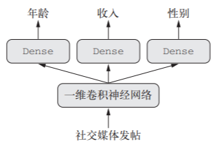
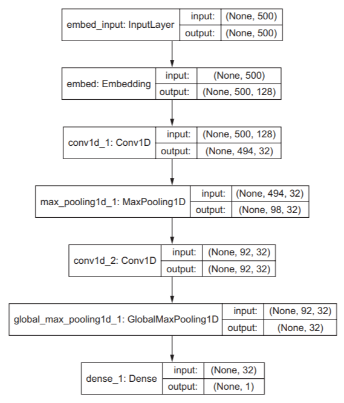
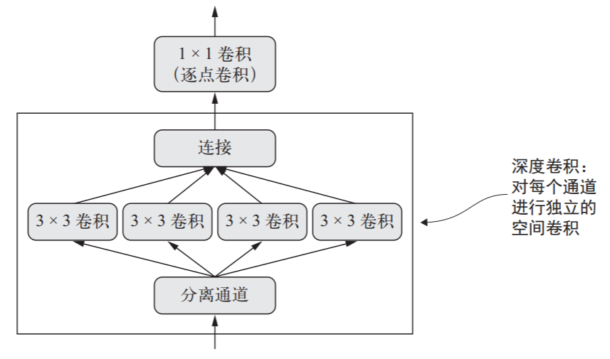

# 高级深度学习实践

##　不用Sequential 模型的解决方案：Keras 函数式API
Sequential只能生成一个输入一个输出的线性堆叠模型
### Sequential的函数式写法
``` python
from keras.models import Sequential
import numpy as np

seq_model = Sequential()
seq_model.add(layers.Dense(32, activation='relu', input_shape=(64,)))
seq_model.add(layers.Dense(32, activation='relu'))
seq_model.add(layers.Dense(10, activation='softmax'))
# seq_model.summary()

seq_model.compile(optimizer='rmsprop', loss='categorical_crossentropy')
x_train = np.random.random((1000, 64))
y_train = np.random.random((1000, 10))
seq_model.fit(x_train, y_train, epochs=10, batch_size=128)
score = seq_model.evaluate(x_train, y_train)
```
写成
```
from keras.models import Model
from keras import layers
from keras import Input
import numpy as np

input_tensor = Input(shape=(64,))
x = layers.Dense(32, activation='relu')(input_tensor)
x = layers.Dense(32, activation='relu')(x)
output_tensor = layers.Dense(10, activation='softmax')(x)
model = Model(input_tensor, output_tensor)
# model.summary()

model.compile(optimizer='rmsprop', loss='categorical_crossentropy')
x_train = np.random.random((1000, 64))
y_train = np.random.random((1000, 10))
model.fit(x_train, y_train, epochs=10, batch_size=128)
score = model.evaluate(x_train, y_train)
```
dense = layers.Dense(32, activation='relu') 定义了一个层，也定义了一个函数

### 多输入模型


``` python
from keras.models import Model
from keras import layers
from keras import Input

text_vocabulary_size = 10000
question_vocabulary_size = 10000
answer_vocabulary_size = 500

text_input = Input(shape=(None,), dtype='int32', name='text')
embedded_text = layers.Embedding(text_vocabulary_size, 64)(text_input)
encoded_text = layers.LSTM(32)(embedded_text)

question_input = Input(shape=(None,), dtype='int32', name='question')
embedded_question = layers.Embedding(question_vocabulary_size, 32)(question_input)
encoded_question = layers.LSTM(16)(embedded_question)

concatenated = layers.concatenate([encoded_text, encoded_question],
 axis=-1)
answer = layers.Dense(answer_vocabulary_size, activation='softmax')(concatenated) 

model = Model([text_input, question_input], answer)
model.compile(optimizer='rmsprop', loss='categorical_crossentropy', metrics=['acc'])

import numpy as np
num_samples = 1000
max_length = 100
text = np.random.randint(1, text_vocabulary_size, size=(num_samples, max_length))
question = np.random.randint(1, question_vocabulary_size, size=(num_samples, max_length))
answers = np.random.randint(answer_vocabulary_size, size=(num_samples))
answers = keras.utils.to_categorical(answers, answer_vocabulary_size)

# 方法一
model.fit([text, question], answers, epochs=10, batch_size=128)
# 方法二，对应输入名字的字典形式
model.fit({'text': text, 'question': question}, answers, epochs=10, batch_size=128)
```
### 多输出模型


``` python
from keras import layers,Input
from keras.models import Model

vocabulary_size = 50000
num_income_groups = 10

posts_input = Input(shape=(None,), dtype='int32', name='posts')
embedded_posts = layers.Embedding(256, vocabulary_size)(posts_input)
x = layers.Conv1D(128, 5, activation='relu')(embedded_posts)
x = layers.MaxPooling1D(5)(x)
x = layers.Conv1D(256, 5, activation='relu')(x)
x = layers.Conv1D(256, 5, activation='relu')(x)
x = layers.MaxPooling1D(5)(x)
x = layers.Conv1D(256, 5, activation='relu')(x)
x = layers.Conv1D(256, 5, activation='relu')(x)
x = layers.GlobalMaxPooling1D()(x)
x = layers.Dense(128, activation='relu')(x)

age_prediction = layers.Dense(1, name='age')(x)
income_prediction = layers.Dense(num_income_groups, activation='softmax', name='income')(x)
gender_prediction = layers.Dense(1, activation='sigmoid', name='gender')(x)
model = Model(posts_input, [age_prediction, income_prediction, gender_prediction])

# 编译，方法一，数组格式
model.compile(optimizer='rmsprop', 
	loss=['mse', 'categorical_crossentropy', 'binary_crossentropy'])
# 方法二，如果有名字的话可以用字典的方式
model.compile(optimizer='rmsprop', 
	loss={'age': 'mse', 
			'income': 'categorical_crossentropy', 
			'gender': 'binary_crossentropy'})
# 方法三，增加权重
model.compile(optimizer='rmsprop',
	loss=['mse', 'categorical_crossentropy', 'binary_crossentropy'],
	loss_weights=[0.25, 1., 10.])
# 方法四，增加权重
model.compile(optimizer='rmsprop',
	loss={'age': 'mse',
		'income': 'categorical_crossentropy',
		'gender': 'binary_crossentropy'},
	loss_weights={'age': 0.25,
		'income': 1.,
		'gender': 10.})
	
# 训练，方法一，
model.fit(posts, [age_targets, income_targets, gender_targets],
	epochs=10, 
	batch_size=64)
# 方法二
model.fit(posts, {'age': age_targets,
					'income': income_targets,
					'gender': gender_targets},
	epochs=10, 
	batch_size=64)
```
### 层组成的有向无环图
- Inception 模块


``` python
from keras import layers

branch_a = layers.Conv2D(128, 1, activation='relu', strides=2)(x)

branch_b = layers.Conv2D(128, 1, activation='relu')(x)
branch_b = layers.Conv2D(128, 3, activation='relu', strides=2)(branch_b)

branch_c = layers.AveragePooling2D(3, strides=2)(x)
branch_c = layers.Conv2D(128, 3, activation='relu')(branch_c)

branch_d = layers.Conv2D(128, 1, activation='relu')(x)
branch_d = layers.Conv2D(128, 3, activation='relu')(branch_d)
branch_d = layers.Conv2D(128, 3, activation='relu', strides=2)(branch_d)

output = layers.concatenate([branch_a, branch_b, branch_c, branch_d], axis=-1)
```
完整的Inception V3架构内置于keras.applications.inception_v3.InceptionV3，其中包含了在 ImageNet 数据集上预训练得到的权重

- 残差网络
残差连接解决了困扰所有大规模深度学习模型的两个共性问题：**梯度消失**和**表示瓶颈**。残差连接让前面某层的输出直接作为后面某层的输入，从而在序列网络中有效地创造了一条捷径，减少了信息丢失。
如果特征图的尺寸相同，使用恒等残差连接（identity residual connection）
``` python
from keras import layers
x = ... #一个四维输入张量
y = layers.Conv2D(128, 3, activation='relu', padding='same')(x)
y = layers.Conv2D(128, 3, activation='relu', padding='same')(y)
y = layers.Conv2D(128, 3, activation='relu', padding='same')(y)
y = layers.add([y, x])
```
如果特征图的尺寸不同，使用线性残差连接（linear residual connection）
``` python
from keras import layers
x = ... #一个四维输入张量
y = layers.Conv2D(128, 3, activation='relu', padding='same')(x)
y = layers.Conv2D(128, 3, activation='relu', padding='same')(y)

y = layers.MaxPooling2D(2, strides=2)(y)
residual = layers.Conv2D(128, 1, strides=2, padding='same')(x)
y = layers.add([y, residual])
```
### 共享层权重
多次重复使用一个层实例，可以重复使用该层相同的权重。

``` python
from keras import layers
from keras import Input
from keras.models import Model

# 学习一个LSTM模型来处理left和right的输入
lstm = layers.LSTM(32)

left_input = Input(shape=(None, 128))
left_output = lstm(left_input)
right_input = Input(shape=(None, 128))
right_output = lstm(right_input)
merged = layers.concatenate([left_output, right_output], axis=-1

predictions = layers.Dense(1, activation='sigmoid')(merged)
model = Model([left_input, right_input], predictions)
model.fit([left_data, right_data], targets)
```

### 将模型作为层
可以像使用层一样使用模型，输入-输出，层和模型都是一样的
``` python
from keras import layers
from keras import applications
from keras import Input
# xception网络的卷积基
xception_base = applications.Xception(weights=None, include_top=False)

left_input = Input(shape=(250, 250, 3))
right_input = Input(shape=(250, 250, 3))
left_features = xception_base(left_input)
right_input = xception_base(right_input)
merged_features = layers.concatenate([left_features, right_input], axis=-1)
```

## 使用Keras 回调函数和TensorBoard来检查并监控深度学习模型
回调函数（callback）是在调用 fit 时传入模型的一个对象，它在训练过程中的不同时间点都会被模型调用。它可以访问关于模型状态与性能的所有可用数据，还可以采取行动：中断训练、保存模型、加载一组不同的权重或改变模型的状态。
回调函数常用功能：
- 模型检查点（model checkpointing）：在训练过程中的不同时间点保存模型的当前权重。
- 提前终止（early stopping）：如果验证损失不再改善，则中断训练（当然，同时保存在训练过程中得到的最佳模型）。
-  在训练过程中动态调节某些参数值：比如优化器的学习率。
-  在训练过程中记录训练指标和验证指标，或将模型学到的表示可视化
常用的类
``` python
keras.callbacks.ModelCheckpoint
keras.callbacks.EarlyStopping
keras.callbacks.LearningRateScheduler
keras.callbacks.ReduceLROnPlateau
keras.callbacks.CSVLogger
```
CASE1  ModelCheckpoint 与 EarlyStopping 回调函数early stop并保存最优模型
``` python
import keras
callbacks_list = [
	keras.callbacks.EarlyStopping(
		monitor='acc',
		patience=1, # 如果下一轮没有更高的acc则stop
	),
	keras.callbacks.ModelCheckpoint(
		filepath='my_model.h5',
		monitor='val_loss',
		save_best_only=True,#如果loss不是更低则不更新模型文件
	)
]

model.compile(optimizer='rmsprop',
	loss='binary_crossentropy',
	metrics=['acc'])

model.fit(x, y,
	epochs=10,
	batch_size=32,
	callbacks=callbacks_list,
	validation_data=(x_val, y_val)
)
```
CASE2 ReduceLROnPlateau降低学习率
``` python
callbacks_list = [
	keras.callbacks.ReduceLROnPlateau(
		monitor='val_loss'
		factor=0.1, # 触发时将学习率除以 10
		patience=10, # 如果验证损失在10轮内没有改善，则触发回调函数
	)
]
model.fit(x, y,
	epochs=10,
	batch_size=32,
	callbacks=callbacks_list,
	validation_data=(x_val, y_val)
) 
```
CASE3 自定义回调函数
继承父类 keras.callbacks.Callback
可以重写的函数：
on_epoch_begin #在每轮开始时被调用  
on_epoch_end  
on_batch_begin #在处理每个批量之前被调用  
on_batch_end  
on_train_begin #在训练开始时被调用  
on_train_end   
如，在每轮结束后将模型每层的验证预测保存到硬盘 
``` python
import keras
import numpy as np
class ActivationLogger(keras.callbacks.Callback):
	def set_model(self, model):
		self.model = model
		layer_outputs = [layer.output for layer in model.layers]
		self.activations_model = keras.models.Model(model.input, layer_outputs)

	def on_epoch_end(self, epoch, logs=None):
		if self.validation_data is None:
			raise RuntimeError('Requires validation_data.')
		# 获取验证数据的第一个输入样本
		validation_sample = self.validation_data[0][0:1]
		activations = self.activations_model.predict(validation_sample)
		f = open('activations_at_epoch_' + str(epoch) + '.npz', 'w')
		np.savez(f, activations)
		f.close()
```

## 可视化框架TensorFlow
可视化的作用
- 在训练过程中以可视化的方式监控指标
- 将模型架构可视化
- 将激活和梯度的直方图可视化
- 以三维的形式研究嵌入
``` python
import keras
from keras import layers
from keras.datasets import imdb
from keras.preprocessing import sequence

max_features = 2000
max_len = 500

(x_train, y_train), (x_test, y_test) =imdb.load_data(num_words=max_features)
x_train = sequence.pad_sequences(x_train, maxlen=max_len)
x_test = sequence.pad_sequences(x_test, maxlen=max_len)
model = keras.models.Sequential()
model.add(layers.Embedding(max_features, 128,
			input_length=max_len, name='embed')
		)
model.add(layers.Conv1D(32, 7, activation='relu'))
model.add(layers.MaxPooling1D(5))
model.add(layers.Conv1D(32, 7, activation='relu'))
model.add(layers.GlobalMaxPooling1D())
model.add(layers.Dense(1))
#model.summary()
model.compile(optimizer='rmsprop',
				loss='binary_crossentropy',
				metrics=['acc']
			)
# 使用回调函数来接受模型训练日志生成监控图形
callbacks = [
	keras.callbacks.TensorBoard(
		log_dir='my_log_dir',
		histogram_freq=1, # 每一轮之后记录激活直方图
		embeddings_freq=1, # 每一轮之后记录嵌入数据
	)
]
history = model.fit(x_train, y_train,
						epochs=20,
						batch_size=128,
						validation_split=0.2,
						callbacks=callbacks
					)
```
启动tensorboard，访问http://localhost:6006
``` shell
$ tensorboard --logdir=my_log_dir
```

- HISTOGRAMS（直方图）
- EMBEDDINGS（嵌入）， 可以用主成分分析（PCA）、t-分布、随机近邻嵌入（t-SNE）降维展示
- GRAPHS（图），底层 TensorFlow 运算图的交互式可视化

### plot_model函数
直接将模型保存为一个图片
``` python
from keras.utils import plot_model
plot_model(model, show_shapes=True, to_file='model.png')
```


## 让模型性能发挥到极致
### 高级架构模式
- 1. 批标准化 BatchNormalization
训练过程中在内部保存已读取的每批数据均值和方差，进行层之间的标准化；  
BatchNormalization有助于梯度传播（这一点和残差连接很像），因此允许更深的网络。对于有些特别深的网络，只有包含多个 BatchNormalization 层时才能进行训练；  
BatchNormalization 广泛用于许多高级卷积神经网络架构，比如 ResNet50、Inception V3 和 Xception。  
BatchNormalization 层通常在卷积层或密集连接层之后使用。
``` python
conv_model.add(layers.Conv2D(32, 3, activation='relu'))
conv_model.add(layers.BatchNormalization()) # 卷积层后
```
``` python
dense_model.add(layers.Dense(32, activation='relu'))
dense_model.add(layers.BatchNormalization()) # 全连接层后
```

- 2. 深度可分离卷积 SeparableConv2D
将空间特征学习和通道特征学习分开，它需要的参数要少很多，计算量也更小，它是一种执行卷积更高效的方法，可以得到性能更好的模型

``` python 
from keras.models import Sequential, Model
from keras import layers
height = 64
width = 64
channels = 3
num_classes = 10
model = Sequential()
model.add(layers.SeparableConv2D(32, 3,
			activation='relu',
			input_shape=(height, width, channels,))
		)
model.add(layers.SeparableConv2D(64, 3, activation='relu'))
model.add(layers.MaxPooling2D(2))
model.add(layers.SeparableConv2D(64, 3, activation='relu'))
model.add(layers.SeparableConv2D(128, 3, activation='relu'))
model.add(layers.MaxPooling2D(2))
model.add(layers.SeparableConv2D(64, 3, activation='relu'))
model.add(layers.SeparableConv2D(128, 3, activation='relu'))
model.add(layers.GlobalAveragePooling2D())
model.add(layers.Dense(32, activation='relu'))
model.add(layers.Dense(num_classes, activation='softmax'))
model.compile(optimizer='rmsprop', loss='categorical_crossentropy')
```

### 超参数优化
超参数优化的过程通常
- (1) 选择一组超参数（自动选择）
- (2) 构建相应的模型
- (3) 将模型在训练数据上拟合，并衡量其在验证数据上的最终性能
- (4) 选择要尝试的下一组超参数（自动选择）
- (5) 重复上述过程
- (6) 最后，衡量模型在测试数据上的性能

Hyperopt，是一个用于超参数优化的 Python 库，其内部使用 Parzen 估计器的树来预测哪组超
参数可能会得到好的结果；  
Hyperas，将 Hyperopt 与 Keras 模型集成在一起。

### 模型集成 Model Ensembling
集成依赖于这样的假设，即对于独立训练的不同良好模型，它们表现良好可能是因为不同的原因：每个模型都从略有不同的角度观察数据来做出预测，得到了“真相”的一部分，但不是全部真相，
因此，集成的模型应该尽可能好，同时尽可能不同。
