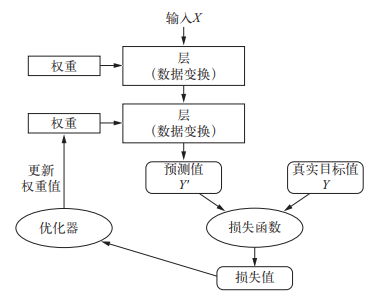
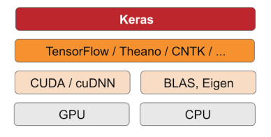

[toc]

# Keras深度学习入门篇

# 第一部分：机器学习基础

## 一、机器学习的四个分支

1. 监督学习
- 分类
- 回归
- 序列生成，给定一张图像，预测描述图像的文字
- 语法树预测，给定一个句子，预测其分解生成的语法树
- 目标检测，给定一张图像，在图中特定目标的周围画上一个边界框
- 图像分割，给定一张图像，在特定物体上画一个像素级的掩模
2. 无监督学习
常用于数据可视化、数据压缩、数据去噪或者更好的理解数据中的相关性
- 降维
- 聚类
3. 自监督学习
没有人工标注标签的监督学习，比如根据给定文本中前面的词来预测下一个词
4. 强化学习
接收环境信息，并学会选择使某种奖励最大化，如下围棋

## 二、张量（Tensor）是什么？

&nbsp;&nbsp;&nbsp;&nbsp;张量是矩阵向任意维度的推广，是N维数组，能张能缩的变量。  
张量的三个关键属性  
1）维度、轴的个数、阶， ndim  
2）形状， shape。  
3）数据类型，dtype
通常，只有数字张量，没有字符张量，因为张量存储在预先分配的连续内存段中，而字符串的长度是可变的，无法用这种方式存储  

- 标量（0D 张量， scalar，也叫标量张量、零维张量）
```python
>>> import numpy as np
>>> x = np.array(13)
>>> x
array(13)
>>> x.ndim
0
```

- 向量（1D 张量， vector，一维张量）
```python
>>> x = np.array([12, 3, 6, 14, 7])
>>> x
array([12, 3, 6, 14, 7])
>>> x.ndim
1
```

- 矩阵（2D 张量，matrix）  
```python
>>> x = np.array([[5, 78, 2, 34, 0],
[6, 79, 3, 35, 1],
[7, 80, 4, 36, 2]])
>>> x.ndim
2
```
向量数据： 2D 张量，形状为 (samples, features)  
比如，人口统计数据集，其中包括每个人的年龄、邮编和收入。每个人可以表示为包含 3 个值的向量，而整个数据集包含 100000 个人，因此可以存储在形状为 (100000, 3) 的 2D张量中

- 3D 张量
```python
>>> x = np.array([[[5, 78, 2, 34, 0],
[6, 79, 3, 35, 1],
[7, 80, 4, 36, 2]],
[[5, 78, 2, 34, 0],
[6, 79, 3, 35, 1],
[7, 80, 4, 36, 2]],
[[5, 78, 2, 34, 0],
[6, 79, 3, 35, 1],
[7, 80, 4, 36, 2]]])
>>> x.ndim
3
```
时间序列数据或序列数据： 3D 张量，形状为 (samples, timesteps, features)  
比如，股票价格数据集，每一分钟，我们将股票的当前价格、前一分钟的最高价格、最低价格保存为一个 3D 向量，整个交易日的数据为 (390, 3) 的 2D 张量（一个交易日有 390 分钟），250 天的数据则可以保存为 (250, 390, 3) 的 3D 张量  

- 4D 张量
形状为 (samples, height, width, channels) 或 (samples, channels, height, width)  
比如，128张照片（256*256px）的彩色照片可以表示为(128, 256, 256, 3)；  

- 5D 张量
形状为 (samples, frames, height, width, channels) 或 (samples, frames, channels, height, width)  
比如，一个以每秒 4 帧采样的 60 秒 YouTube 视频片段，视频尺寸为 144× 256，共有 240 帧， 4 个这样的视频片段组成的批量将保存在形状为 (4, 240, 144, 256, 3)的张量中  

## 张量的运算（参考矩阵运算）
- 逐元素运算，如，加减法，one by one 对齐齐
- 广播，维度不够，重复使用来凑，如，矩阵加一个常数中的常数
- 点积，如，矩阵乘法
- 变形，如转置


# 第二部分：深度学习基础

## 一、深度学习过程
  
想象有两张彩纸：一张红色，一张蓝色，将其中一张纸放在另一张上，揉成小球。这个皱巴巴的纸球就是你的输入数据，每张纸对应于分类问题中的一个类别。深度学习，就是通过一序列的的变换来一点点展开小球。  
  
(1) 抽取训练样本 x 和对应目标y组成的数据批量
(2) 在x上运行网络，得到预测值y_pred
(3) 计算网络在这批数据上的损失，用于衡量y_pred和y之间的距离
(4) 计算损失相对于网络参数的梯度［一次反向传播（backward pass）］
(5) 将参数沿着梯度的反方向移动一点，比如 W -= step * gradient，从而使这批数据上的损失减小一点

## 二、层（level）
多个层组合成网络（或模型）,常用的层有：
- 全连接层（ fully connected layer），也叫密集连接层（densely connected layer）、密集层（dense layer）
- 循环层（ recurrent layer，比如 Keras 的 LSTM 层）通常来处理形状为 (samples, timesteps, features) 的 3D 张量序列数据
- 卷积层（ Keras 的 Conv2D），通常用来处理保存在 4D 张量中的图像数据  

多层组成的网络结构可分为：
- 串行网络
- 双分支（ two-branch）网络
- 多头（ multihead）网络
- Inception 模块  
选择正确的网络架构更像是一门艺术

## 三、损失函数（ loss function）
用于学习的反馈信号，衡量在训练数据上的性能，在训练过程中需要将其最小化。它能够衡量当前任务是否已成功完成。

## 四、优化器（ optimizer）
决定学习过程如何进行，决定如何基于损失函数对网络进行更新，它执行的是随机梯度下降（ SGD）的某个变体。

- 梯度
梯度（ gradient）是张量运算的导数，它是导数向多元函数导数的推广  
```python
y_pred = dot(W, x)
loss_value = loss(y_pred, y)
//如果输入数据x和y保持不变，那么这可以看作将W映射到损失值的函数
loss_value = f(W)
```
gradient(f)(W0)是函数f(W)在W0的导数  
对于张量的函数 f(W)，你可以通过将W向梯度的反方向移动来减小f(W)，
比如 W1 = W0 - step * gradient(f)(W0)，其中 step 是一个很小的比例因子。（注意，比例因子step是必需的，因为gradient(f)(W0) 只是W0附近曲率的近似值，不能离W0太远）于是还会有W2、W3、、直至收敛

- 随机梯度下降可分为  
每次迭代取小批量的数据 —— 小批量SGD  
每次迭代取一个数据 —— 真SGD  
每一次迭代都在所有数据上运行 —— 批量SGD  

- SGD 还有多种变体  
优化点在于计算下一次权重更新时还考虑了上一次的权重更新，比如带动量的SGD、 Adagrad、RMSProp等变体。这些变体被称为优化方法（ optimization method）或优化器（ optimizer）。  
	动量的概念源自物理学，动量解决了 SGD 的两个问题：**收敛速度**和**局部极小点**。动量方法的实现过程是每一步移动小球，不仅要考虑当前的斜率值（加速度），还要考虑当前的速度（来自于之前的加速度）。在实践中指的是，更新参数 w 不仅要考虑当前的梯度值，还要考虑上一次的梯度值	

- 反向传播（ backpropagation，有时也叫反式微分， reverse-mode differentiation）  
将链式法则应用于神经网络梯度值的计算，得到的算法叫作反向传播。反向传播从最终损失值开始，从最顶层反向作用至最底层，利用链式法则计算每个参数对损失值的贡献大小

## 五、监控指标（metric）
在训练和测试过程中需要监控的指标，常见的指标，比如准确率

Accuracy metrics  
- Accuracy
- BinaryAccuracy
- CategoricalAccuracy
- TopKCategoricalAccuracy
- SparseTopKCategoricalAccuracy  

Probabilistic metrics  
- BinaryCrossentropy
- CategoricalCrossentropy
- SparseCategoricalCrossentropy
- KLDivergence
- Poisson

Regression metrics
- MeanSquaredError
- RootMeanSquaredError
- MeanAbsoluteError
- MeanAbsolutePercentageError
- MeanSquaredLogarithmicError
- CosineSimilarity
- LogCoshError

Classification metrics based on True/False positives & negatives
- AUC
- Precision
- Recall
- TruePositives
- TrueNegatives
- FalsePositives
- FalseNegatives
- PrecisionAtRecall
- SensitivityAtSpecificity
- SpecificityAtSensitivity

Image segmentation metrics
- MeanIoU

Hinge metrics for "maximum-margin"ification
- Hinge
- SquaredHinge
- CategoricalHinge

# 第三部分：Keras基础

## 一、Keras是什么？

Keras 是一个模型级（ model-level）的Python深度学习框架  
keras可以方便地定义和训练几乎所有类型的深度学习模型，具有以下重要特性：

- 相同的代码可以在**CPU或GPU**上无缝切换运行
- 具有用户友好的**API**，便于快速开发深度学习模型的原型
- 内置支持卷积网络（用于计算机视觉）、循环网络（用于序列处理）以及二者的任意
组合
- 支持任意网络架构：多输入或多输出模型、层共享、模型共享等。这也就是说， Keras
能够构建任意深度学习模型，无论是生成式对抗网络还是神经图灵机  

## 二、Keras和Tensorflow有什么关系？  
  
- keras提供了一个高层次的构建模块  
- Keras 有三个后端实现方式： TensorFlow、Theano、微软认知工具包（ CNTK， Microsoft cognitive toolkit）   
- NVIDIA CUDA 深度神经网络库（ cuDNN），是 在 GPU 上，TensorFlow封装的一个高度优化的深度学习运算库  
- Eigen，是TensorFlow封装的一个低层次的张量运算库  

## 三、Keras的开发步骤
1) 定义训练**数据**：输入张量和目标张量
2) 定义层组成的**网络**（或模型），将输入映射到目标
3) **配置**学习过程：选择优化器、损失函数、监控指标
4) 调用模型的 fit 方法在训练数据上进行**迭代**

```python
from keras import models
from keras import layers
from keras import optimizers

# 创建方式1
model = models.Sequential()
model.add(layers.Dense(32, activation='relu', input_shape=(784,)))
model.add(layers.Dense(10, activation='softmax'))
model.compile(optimizer=optimizers.RMSprop(lr=0.001), 
				   loss='mse',
				metrics=['accuracy'])
model.fit(input_tensor, target_tensor, batch_size=128, epochs=10)

# 创建方式2
# 下面是用函数式 API 定义的相同模型。
input_tensor = layers.Input(shape=(784,))
x = layers.Dense(32, activation='relu')(input_tensor)
output_tensor = layers.Dense(10, activation='softmax')(x)
model = models.Model(inputs=input_tensor, outputs=output_tensor)
```


# 第四部分：Quickly Start

## 一、四份常见的数据实践 

| Case场景 | 数据            | 数据结构（x.shape, y.shape）                                 | 网络结构                                                     | 优化器  | 损失函数                           | 监控指标 |
| -------- | --------------- | ------------------------------------------------------------ | ------------------------------------------------------------ | ------- | ---------------------------------- | -------- |
| 多分类   | MNIST手写字识别 | train: (60000, 28, 28) (60000,)<br/> test: (10000, 28, 28) (10000,) | (512, activation='relu', input_shape=(28 * 28,))<br/>(10, activation='softmax') | rmsprop | categorical_crossentropy           | accuracy |
| 二分类   | 电影评论IMDB    | train: (25000,) (25000,)<br/> test: (25000,) (25000,)        | (16, activation='relu', input_shape=(10000,))<br/>(16, activation='relu')<br/>(1, activation='sigmoid') | rmsprop | 二元交叉熵binary_crossentropy      | accuracy |
| 多分类   | 新闻分类        | train: (8982,) (8982,)<br/> test: (2246,) (2246,)            | (64, activation='relu', input_shape=(10000,))<br/>(64, activation='relu')<br/>(46, activation='softmax') | rmsprop | 分类交叉熵categorical_crossentropy | accuracy |
| 回归问题 | 房价预测        | train: (404, 13) (404,) <br/>test: (102, 13) (102,)          | (64, activation='relu', input_shape=(13,)<br/>(64, activation='relu')<br/>(1) | rmsprop | 均方误差mse                        | mae      |
附上源码，欢迎上手实践 

## 二、过拟合，泛化能力不强

- 最优的解决办法是获取更多的训练数据
- 减小网络大小
- 添加权重正则化
- 添加dropout正则化
在训练过程中随机将该层的一些输出特征舍弃（设置为0），在层的输出值中引入噪声，打破不显著的偶然模式
## 三、欠拟合，模型能力不强

- 添加更多的层
- 让每一层更大
- 训练更多的轮次


# 参考文章&图书

[Keras文档](https://keras.io/)  
[Keras中文文档](https://keras.io/zh/)  
[TensorFlow中文官网](https://www.tensorflow.org/)

《Python深度学习》


> @ WHAT - HOW - WHY

