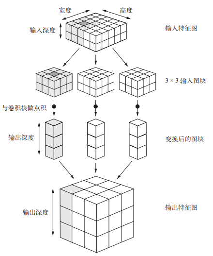
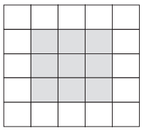
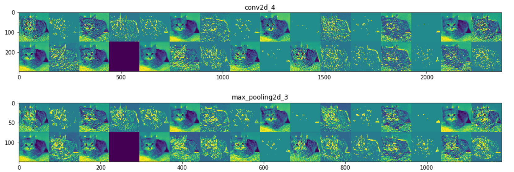

[TOC]

# 第一部分 认识CNN
## 一、quickly start
所见即所得，先看一下CNN在MNIST上的运行Demo
```python
from keras import layers
from keras import models

model = models.Sequential()
# 定义一个卷积输入层，卷积核是3*3，共32个，输入是(28, 28, 1)，输出是(26, 26, 32)
model.add(layers.Conv2D(32, (3, 3), activation='relu', input_shape=(28, 28, 1)))
# 定义一个2*2的池化层
model.add(layers.MaxPooling2D((2, 2)))
model.add(layers.Conv2D(64, (3, 3), activation='relu'))
model.add(layers.MaxPooling2D((2, 2)))
model.add(layers.Conv2D(64, (3, 3), activation='relu'))
# 将所有的输出展平
model.add(layers.Flatten())
# 定义一个全连接层，有64个神经元
model.add(layers.Dense(64, activation='relu'))
# 多分类问题，将输出在每个分类上的概率
model.add(layers.Dense(10, activation='softmax'))
model.summary()
```
打印网络结构
```
_________________________________________________________________
Model: "sequential_1"
_________________________________________________________________
Layer (type)                 Output Shape              Param #   
_________________________________________________________________
conv2d_1 (Conv2D)            (None, 26, 26, 32)        320       
_________________________________________________________________
max_pooling2d_1 (MaxPooling2 (None, 13, 13, 32)        0         
_________________________________________________________________
conv2d_2 (Conv2D)            (None, 11, 11, 64)        18496     
_________________________________________________________________
max_pooling2d_2 (MaxPooling2 (None, 5, 5, 64)          0         
_________________________________________________________________
conv2d_3 (Conv2D)            (None, 3, 3, 64)          36928     
_________________________________________________________________
flatten_1 (Flatten)          (None, 576)               0         
_________________________________________________________________
dense_1 (Dense)              (None, 64)                36928     
_________________________________________________________________
dense_2 (Dense)              (None, 10)                650       
_________________________________________________________________
Total params: 93,322
Trainable params: 93,322
Non-trainable params: 0
_________________________________________________________________
```
加载数据开始训练
```python
from keras.datasets import mnist
from keras.utils import to_categorical

(train_images, train_labels), (test_images, test_labels) = mnist.load_data()

train_images = train_images.reshape((60000, 28, 28, 1))
train_images = train_images.astype('float32') / 255

test_images = test_images.reshape((10000, 28, 28, 1))
test_images = test_images.astype('float32') / 255

train_labels = to_categorical(train_labels)
test_labels = to_categorical(test_labels)
print('train data:', train_images.shape, train_labels.shape)
print('test data:', test_images.shape, test_labels.shape)

# 训练数据准确的已经明显优于全连接网络
model.compile(optimizer='rmsprop',
              loss='categorical_crossentropy',
              metrics=['accuracy'])
model.fit(train_images, train_labels, epochs=5, batch_size=64)
test_loss, test_acc = model.evaluate(test_images, test_labels)
print(test_loss, test_acc)
```
train data: (60000, 28, 28, 1) (60000, 10)  
test data: (10000, 28, 28, 1) (10000, 10)  
0.025266158195689788  
0.9919000267982483  

## 二、卷积网络介绍
全连接层与卷积层根本的区别在于，全连接层从输入特征空间中学到的是全局模式，而卷积层学到的是局部模式
- 卷积神经网络具有平移不变性，一个地方学到的识别能力可以用到其他的任何地方
- 卷积神经网络可以学到模式的空间层次结构  

``` python
# CNN在Keras上的API
tf.keras.layers.Conv2D(
    filters, # 卷积核的个数
    kernel_size, # 卷积核的大小，常用的是（3，3）
    strides=(1, 1), # 核移动步幅
    padding='valid', # 是否需要边界填充
    data_format=None,
    dilation_rate=(1, 1), 
    activation=None, # 激活函数
    use_bias=True,
    kernel_initializer='glorot_uniform',
    bias_initializer='zeros',
    kernel_regularizer=None, 
    bias_regularizer=None, 
    activity_regularizer=None,
    kernel_constraint=None, 
    bias_constraint=None, 
    **kwargs
)
```
### 2.1 卷积核运算
  
卷积计算类似于点积，一个矩阵(3, 3, 2)卷积(3, 3, 2)的结果是(1)  
如上图所示：    
输入为 (5, 5, 2) （高， 宽， 深度）  
卷积核为 (3, 3, 2)    
一个卷积核的输出为 (3, 3, 1)  
三个卷积核的输出为 (3, 3, 3)
图中输出深度(1, 1, 3)表示的是三个卷积核在一个位置上的输出

### 2.2 边界填充Padding  
  
边界填充的目的是为了充分发掘边界的信息，确保每个点都成为过**核心**，所以  
对于(3, 3)的卷积核，我们往左右同时增加一列；  
对于(5, 5)的卷积核，我们左右同时增加两列。  
参数padding='same'表示需要边界填充

### 2.3 卷积步幅strides  
步幅很好理解，就是卷积核计算完后需要往下一格挪动几个位置

### 2.4 最大池化层MaxPooling  
最大池化层通常使用2*2的窗口，步幅为2进行**特征下采样**  
作用有二：  
1、减少需要处理的特征图的元素个数  
2、增加卷积层的观察窗口（即窗口覆盖原始输入的比例越来越大）  
一个张量输入(28, 28, 32)，经过(2, 2)的MaxPooling处理，输出张量(14, 14, 32)，其过程直观的可以理解为取相邻(2, 2)矩阵里面的最大值。当然也有其他的处理方法，比如取平均值。

# 第二部分：CNN在Keras上的实践

## 一、做好基础数据准备
实践案例：猫狗分类  
数据下载：https://www.kaggle.com/c/dogs-vs-cats/data  
源数据： 2000 张猫的图像 + 2000 张狗的图像  
数据划分： 2000 张训练，1000 张验证，1000张测试  

- 数据准备，从下载好的数据中清洗出源数据
目录结构：  
cat-dog-small  
├─test  
│  ├─cats 500张   
│  └─dogs 500张  
├─train  
│  ├─cats 1000张  
│  └─dogs 1000张  
└─validation  
    ├─cats 500张  
    └─dogs 500张  

```python
import os, shutil
# The path to the directory where the original
# dataset was uncompressed
original_dataset_dir = 'D://Kaggle//cat-dog//train'

# The directory where we will
# store our smaller dataset
base_dir = 'D://Kaggle//cat-dog-small'
os.mkdir(base_dir)

# Directories for our training splits
train_dir = os.path.join(base_dir, 'train')
os.mkdir(train_dir)
train_cats_dir = os.path.join(train_dir, 'cats')
os.mkdir(train_cats_dir)
train_dogs_dir = os.path.join(train_dir, 'dogs')
os.mkdir(train_dogs_dir)

# Directories for our validation splits
validation_dir = os.path.join(base_dir, 'validation')
os.mkdir(validation_dir)
validation_cats_dir = os.path.join(validation_dir, 'cats')
os.mkdir(validation_cats_dir)
validation_dogs_dir = os.path.join(validation_dir, 'dogs')
os.mkdir(validation_dogs_dir)

# Directories for our test splits
test_dir = os.path.join(base_dir, 'test')
os.mkdir(test_dir)
test_cats_dir = os.path.join(test_dir, 'cats')
os.mkdir(test_cats_dir)
test_dogs_dir = os.path.join(test_dir, 'dogs')
os.mkdir(test_dogs_dir)

# Copy first 1000 cat images to train_cats_dir
fnames = ['cat.{}.jpg'.format(i) for i in range(1000)]
for fname in fnames:
    src = os.path.join(original_dataset_dir, fname)
    dst = os.path.join(train_cats_dir, fname)
    shutil.copyfile(src, dst)

# Copy next 500 cat images to validation_cats_dir
fnames = ['cat.{}.jpg'.format(i) for i in range(1000, 1500)]
for fname in fnames:
    src = os.path.join(original_dataset_dir, fname)
    dst = os.path.join(validation_cats_dir, fname)
    shutil.copyfile(src, dst)
    
# Copy next 500 cat images to test_cats_dir
fnames = ['cat.{}.jpg'.format(i) for i in range(1500, 2000)]
for fname in fnames:
    src = os.path.join(original_dataset_dir, fname)
    dst = os.path.join(test_cats_dir, fname)
    shutil.copyfile(src, dst)
    
# Copy first 1000 dog images to train_dogs_dir
fnames = ['dog.{}.jpg'.format(i) for i in range(1000)]
for fname in fnames:
    src = os.path.join(original_dataset_dir, fname)
    dst = os.path.join(train_dogs_dir, fname)
    shutil.copyfile(src, dst)
    
# Copy next 500 dog images to validation_dogs_dir
fnames = ['dog.{}.jpg'.format(i) for i in range(1000, 1500)]
for fname in fnames:
    src = os.path.join(original_dataset_dir, fname)
    dst = os.path.join(validation_dogs_dir, fname)
    shutil.copyfile(src, dst)
    
# Copy next 500 dog images to test_dogs_dir
fnames = ['dog.{}.jpg'.format(i) for i in range(1500, 2000)]
for fname in fnames:
    src = os.path.join(original_dataset_dir, fname)
    dst = os.path.join(test_dogs_dir, fname)
    shutil.copyfile(src, dst)
```
- 数据处理，一切都仰仗于**ImageDataGenerator**  
按批次的从指定目录中获得图片，并解码、归一化  
真的很方便、省心、稳
```python
from keras.preprocessing.image import ImageDataGenerator

# All images will be rescaled by 1./255
train_datagen = ImageDataGenerator(rescale=1./255)
validation_datagen = ImageDataGenerator(rescale=1./255)
test_datagen = ImageDataGenerator(rescale=1./255)

# 分批次的将数据按目录读取出来，ImageDataGenerator会一直取图片，直到break
train_generator = train_datagen.flow_from_directory(
        # This is the target directory
        train_dir,
        # All images will be resized to 150x150
        target_size=(150, 150),
        batch_size=20,
        # Since we use binary_crossentropy loss, we need binary labels
        class_mode='binary')

validation_generator = validation_datagen.flow_from_directory(
        validation_dir,
        target_size=(150, 150),
        batch_size=20,
        class_mode='binary')

test_generator = test_datagen.flow_from_directory(
        test_dir,
        target_size=(150, 150),
        batch_size=20,
        class_mode='binary')
```

Found 2000 images belonging to 2 classes.  
Found 1000 images belonging to 2 classes.  
Found 1000 images belonging to 2 classes.  

## 二、模型迭代
实践流程：  
训练一个无任何优化的基准版本（acc 70%）   
----> 加入了数据增强的版本（acc 81%）   
----> 用预训练好的网络（acc 89%）   
----> 数据增强+预训练好的网络（acc 90%）   
----> 微调预训练的网络（acc 92%）  
----> 数据增强+微调预训练的网络（acc ）  
----> 待续（acc ）  
简而言之，越来越耗时，越来越准

### 2.1 基准网络，全凭灵感
我们搭建起一个四卷积层、四MaxPooling、一展开层、一全连接层、一输出层的基准网络
```python
from keras import layers
from keras import models

model1 = models.Sequential()
model1.add(layers.Conv2D(32, (3, 3), activation='relu', input_shape=(150, 150, 3)))
model1.add(layers.MaxPooling2D((2, 2)))
model1.add(layers.Conv2D(64, (3, 3), activation='relu'))
model1.add(layers.MaxPooling2D((2, 2)))
model1.add(layers.Conv2D(128, (3, 3), activation='relu'))
model1.add(layers.MaxPooling2D((2, 2)))
model1.add(layers.Conv2D(128, (3, 3), activation='relu'))
model1.add(layers.MaxPooling2D((2, 2)))
model1.add(layers.Flatten())
model1.add(layers.Dense(512, activation='relu'))
model1.add(layers.Dense(1, activation='sigmoid'))
model1.summary()
```
```python
Model: "sequential_3"
_________________________________________________________________
Layer (type)                 Output Shape              Param #   
=================================================================
conv2d_8 (Conv2D)            (None, 148, 148, 32)      896       
_________________________________________________________________
max_pooling2d_7 (MaxPooling2 (None, 74, 74, 32)        0         
_________________________________________________________________
conv2d_9 (Conv2D)            (None, 72, 72, 64)        18496     
_________________________________________________________________
max_pooling2d_8 (MaxPooling2 (None, 36, 36, 64)        0         
_________________________________________________________________
conv2d_10 (Conv2D)           (None, 34, 34, 128)       73856     
_________________________________________________________________
max_pooling2d_9 (MaxPooling2 (None, 17, 17, 128)       0         
_________________________________________________________________
conv2d_11 (Conv2D)           (None, 15, 15, 128)       147584    
_________________________________________________________________
max_pooling2d_10 (MaxPooling (None, 7, 7, 128)         0         
_________________________________________________________________
flatten_3 (Flatten)          (None, 6272)              0         
_________________________________________________________________
dense_5 (Dense)              (None, 512)               3211776   
_________________________________________________________________
dense_6 (Dense)              (None, 1)                 513       
=================================================================
Total params: 3,453,121
Trainable params: 3,453,121
Non-trainable params: 0
_________________________________________________________________
```
> 仔细介绍一下**param**参数的计算规则  
- 全连接网络  
total_params = (input_data_channels + 1) * number_of_filters     
参数的总量等于一个神经元的参数量（W,b）乘上神经元个数  
<table>
    <tr>
        <td> dense </td> 
        <td> filters </td> 
        <td> input_shape </td> 
        <td> output_shape </td> 
    </tr>
    <tr>
        <td> dense_5 </td> 
        <td> 512 </td> 
        <td> (6272) </td> 
        <td> (None, 512) </td> 
    </tr>
    <tr>
        <td colspan="4"> params = (6272 + 1) * 522 = 3211776  </td>    
    </tr>
    <tr>
        <td> dense_6 </td> 
        <td> 1 </td> 
        <td> (512) </td> 
        <td> (None, 1) </td> 
    </tr>
    <tr>
        <td colspan="4"> params = (512 + 1) * 1 = 513  </td>    
    </tr>
</table>

- 卷积网络  
total_params = (filter_height * filter_width * input_image_channels + 1) * number_of_filters  
参数的总量等于一个卷积核的参数量（W,b）乘上卷积核的个数  
<table>
    <tr>
        <td> Conv2D </td> 
        <td> filters </td> 
        <td> kernel_size </td>
        <td> input_shape </td> 
        <td> output_shape </td> 
    </tr>
    <tr>
        <td> conv2d_8 </td> 
        <td> 32 </td> 
        <td> (3, 3) </td> 
        <td> (150, 150, 3) </td> 
        <td> (None, 148, 148, 32) </td> 
    </tr>
    <tr>
        <td colspan="5"> params = (3 * 3 * 3 + 1) * 32 = 896 </td> 
    </tr>
    <tr>
        <td> conv2d_9 </td> 
        <td> 64 </td> 
        <td> (3, 3) </td> 
        <td> (74, 74, 32) </td> 
        <td> (None, 72, 72, 64) </td> 
    </tr>
    <tr>
        <td colspan="5"> params = (3 * 3 * 32 + 1) * 64 = 18496 </td> 
    </tr>
    <tr>
        <td> conv2d_10 </td> 
        <td> 128 </td> 
        <td> (3, 3) </td> 
        <td> (36, 36, 64) </td> 
        <td> (None, 34, 34, 128) </td>
    </tr>
    <tr>
        <td colspan="5"> params = (3 * 3 * 64 + 1) * 128 = 73856 </td>
    </tr>
    <tr>
        <td> conv2d_11 </td> 
        <td> 128 </td> 
        <td> (3, 3) </td> 
        <td> (17, 17, 128) </td> 
        <td> (None, 15, 15, 128) </td>
    </tr>
    <tr>
        <td colspan="5"> params = (3 * 3 * 128 + 1) * 128 = 147584 </td> 
    </tr>
</table>

```python
from keras import optimizers

model1.compile(loss='binary_crossentropy',
              optimizer=optimizers.RMSprop(lr=1e-4),
              metrics=['acc'])
history1 = model1.fit_generator(
      train_generator, # 训练数据生成器
      steps_per_epoch=100, # 每一个迭代需要读取100次生成器的数据
      epochs=30, # 迭代次数
      validation_data=validation_generator, # 验证数据生成器
      validation_steps=50) # 需要读取50次才能加载全部的验证集数据
      
# loss的波动幅度有点大
print(model1.metrics_names)
print(model1.evaluate_generator(test_generator, steps=50))
```
输出：  
['loss', 'acc']  
[1.3509974479675293, 0.7329999804496765]  
73%的准确率有点低，加油。  

### 2.2 基准调优，数据增强
通过对ImageDataGenerator实例读取的图像执行多次随机变换不断的丰富训练样本
```python
# 将 train_datagen = ImageDataGenerator(rescale=1./255)
# 修改为 
train_augmented_datagen = ImageDataGenerator(
    rescale=1./255,
    rotation_range=40, # 随机旋转的角度范围
    width_shift_range=0.2, # 在水平方向上平移的范围
    height_shift_range=0.2, # 在垂直方向上平移的范围
    shear_range=0.2, # 随机错切变换的角度
    zoom_range=0.2, # 随机缩放的范围
    horizontal_flip=True,)# 随机将一半图像水平翻转

# Note that the validation data should not be augmented!
train_augmented_generator = train_augmented_datagen.flow_from_directory(
        train_dir,
        target_size=(150, 150),
        batch_size=32,
        class_mode='binary')
```
> 介绍一下flow_from_directory函数的图像增强处理逻辑  

先看flow_from_directory伪代码
```python
xm,y=getDataIndex()#获取所有文件夹中所有图片索引，以及文件夹名也即标签

if shuffle==True:
    shuffle(xm,y)#打乱图片索引及其标签
while(True):
    for i in range(0,len(x),batch_size):
        xm_batch=xm[i:i+batch_size]#文件索引
        y_batch=y[i:i+batch_size]
        x_batch=getImg(xm_batch)#根据文件索引，获取图像数据
        ImagePro(x_batch)#数据增强
        #保存提升后的图片
        #saveToFile()
        yield (x_batch,y_batch)
```
顺序|乱序的将所有图片按张遍历、随机，然后重新开始遍历、随机，只要break不在，咱就不能停止造图片  

``` python
# 重新训练一个模型
model2 = models.Sequential()
model2.add(layers.Conv2D(32, (3, 3), activation='relu', input_shape=(150, 150, 3)))
model2.add(layers.MaxPooling2D((2, 2)))
model2.add(layers.Conv2D(64, (3, 3), activation='relu'))
model2.add(layers.MaxPooling2D((2, 2)))
model2.add(layers.Conv2D(128, (3, 3), activation='relu'))
model2.add(layers.MaxPooling2D((2, 2)))
model2.add(layers.Conv2D(128, (3, 3), activation='relu'))
model2.add(layers.MaxPooling2D((2, 2)))
model2.add(layers.Flatten())
model2.add(layers.Dropout(0.5)) # 新加了dropout层
model2.add(layers.Dense(512, activation='relu'))
model2.add(layers.Dense(1, activation='sigmoid'))

model2.compile(loss='binary_crossentropy',
              optimizer=optimizers.RMSprop(lr=1e-4),
              metrics=['acc'])

history2 = model2.fit_generator(
      train_augmented_generator,
      steps_per_epoch=100, # 每一批次读取100轮数据，总共是3200张图片
      epochs=100,
      validation_data=validation_generator,
      validation_steps=50)
```
运行时间大幅度提升，之前每轮是40秒+，现在每轮是60秒+，acc也有所提升，也还需提升  
['loss', 'acc']  
[0.3123816251754761, 0.8121827244758606]  

### 2.3 VGG16，站在前人的肩上
利用卷积神经网络的可移植性，我们可以使用已经在大型数据集上训练号的网络，常见的有VGG、ResNet、Inception、Inception-ResNet，本篇主要是VGG16。 
首先是下载VGG16网络
```
from keras.applications import VGG16

conv_base = VGG16(weights='imagenet', # 指定模型初始化的权重检查点
                  include_top=False, # 模型最后是否包含密集连接分类器，默认有1000个类别
                  input_shape=(150, 150, 3))
conv_base.summary()
```
输出网络结构
```
Model: "vgg16"
_________________________________________________________________
Layer (type)                 Output Shape              Param #   
=================================================================
input_2 (InputLayer)         (None, 150, 150, 3)       0         
_________________________________________________________________
block1_conv1 (Conv2D)        (None, 150, 150, 64)      1792      
_________________________________________________________________
block1_conv2 (Conv2D)        (None, 150, 150, 64)      36928     
_________________________________________________________________
block1_pool (MaxPooling2D)   (None, 75, 75, 64)        0         
_________________________________________________________________
block2_conv1 (Conv2D)        (None, 75, 75, 128)       73856     
_________________________________________________________________
block2_conv2 (Conv2D)        (None, 75, 75, 128)       147584    
_________________________________________________________________
block2_pool (MaxPooling2D)   (None, 37, 37, 128)       0         
_________________________________________________________________
block3_conv1 (Conv2D)        (None, 37, 37, 256)       295168    
_________________________________________________________________
block3_conv2 (Conv2D)        (None, 37, 37, 256)       590080    
_________________________________________________________________
block3_conv3 (Conv2D)        (None, 37, 37, 256)       590080    
_________________________________________________________________
block3_pool (MaxPooling2D)   (None, 18, 18, 256)       0         
_________________________________________________________________
block4_conv1 (Conv2D)        (None, 18, 18, 512)       1180160   
_________________________________________________________________
block4_conv2 (Conv2D)        (None, 18, 18, 512)       2359808   
_________________________________________________________________
block4_conv3 (Conv2D)        (None, 18, 18, 512)       2359808   
_________________________________________________________________
block4_pool (MaxPooling2D)   (None, 9, 9, 512)         0         
_________________________________________________________________
block5_conv1 (Conv2D)        (None, 9, 9, 512)         2359808   
_________________________________________________________________
block5_conv2 (Conv2D)        (None, 9, 9, 512)         2359808   
_________________________________________________________________
block5_conv3 (Conv2D)        (None, 9, 9, 512)         2359808   
_________________________________________________________________
block5_pool (MaxPooling2D)   (None, 4, 4, 512)         0         
=================================================================
Total params: 14,714,688
Trainable params: 14,714,688
Non-trainable params: 0
_________________________________________________________________
```
先来一个基础版本的——锁定卷积基  
完全冻结所有的网络参数，只使用卷积基的输出训练新分类器
```
# 将（原始数据，label）转换为VGG16的（卷积基输出，label）
def extract_features(directory, sample_count):
    features = np.zeros(shape=(sample_count, 4, 4, 512)) # 卷积基最后一层的输出为(4， 4， 512)
    labels = np.zeros(shape=(sample_count))
    generator = datagen.flow_from_directory(
        directory,
        target_size=(150, 150),
        batch_size=batch_size,
        class_mode='binary')
    i = 0
    for inputs_batch, labels_batch in generator:
        features_batch = conv_base.predict(inputs_batch) # 直接以VGG16的输出作为训练分类器的features
        features[i * batch_size : (i + 1) * batch_size] = features_batch
        labels[i * batch_size : (i + 1) * batch_size] = labels_batch
        i += 1
        if i * batch_size >= sample_count:
            # Note that since generators yield data indefinitely in a loop,
            # we must `break` after every image has been seen once.
            break
    return features, labels
```
接下来只需要按照之前之前的步骤训练一个分类器即可，快得很
```
from keras import models
from keras import layers
from keras import optimizers

model3 = models.Sequential()
model3.add(layers.Dense(256, activation='relu', input_dim=4 * 4 * 512))
model3.add(layers.Dropout(0.5))
model3.add(layers.Dense(1, activation='sigmoid'))

model3.compile(optimizer=optimizers.RMSprop(lr=2e-5),
              loss='binary_crossentropy',
              metrics=['acc'])

history3 = model3.fit(train_features, train_labels,
                    epochs=30,
                    batch_size=20,
                    validation_data=(validation_features, validation_labels))
```
['loss', 'acc']  
[0.25353643798828124, 0.8930000066757202]  
准确率已经到89%了，稳步提升中，

### 2.4 VGG16+数据增强，真强，也真慢  
很自然，我们不满足于89%，我们自然会将数据加强融入其中，简单一点，直接将VGG16作为最终网络的一部分
```
from keras import models
from keras import layers

model4 = models.Sequential()
model4.add(conv_base)
model4.add(layers.Flatten())
model4.add(layers.Dense(256, activation='relu'))
model4.add(layers.Dense(1, activation='sigmoid'))
model4.summary()
```
输出网络结构
```
Model: "sequential_6"
_________________________________________________________________
Layer (type)                 Output Shape              Param #   
=================================================================
vgg16 (Model)                (None, 4, 4, 512)         14714688  
_________________________________________________________________
flatten_5 (Flatten)          (None, 8192)              0         
_________________________________________________________________
dense_11 (Dense)             (None, 256)               2097408   
_________________________________________________________________
dense_12 (Dense)             (None, 1)                 257       
=================================================================
Total params: 16,812,353
Trainable params: 16,812,353
Non-trainable params: 0 
```
继续感受一下1,681万参数带来的震撼  
编译网络之前，我们需要固定卷积基
```
print('This is the number of trainable weights '
      'before freezing the conv base:', len(model4.trainable_weights))
      
conv_base.trainable = False

print('This is the number of trainable weights '
      'before freezing the conv base:', len(model4.trainable_weights))
```
输出
```
This is the number of trainable weights before freezing the conv base: 30
This is the number of trainable weights before freezing the conv base: 4
```
- 冻结之前
VGG16一共19层，5个block，去掉1个输出层，5个MaxPolling层，剩下13层，再加上两个全连接层，总共15层，每层两个可训练权重（主权重W和偏置权重b），trainable_weights=(13+2)*2=30  
- 冻结之后
只有dense_11、dense_12两个全连接层可以训练，trainable_weights=2*2=4  

准备编译
```
model4.compile(loss='binary_crossentropy',
              optimizer=optimizers.RMSprop(lr=2e-5),
              metrics=['acc'])

history4 = model4.fit_generator(
      train_augmented_generator,
      steps_per_epoch=100, # 3200个输入图片，增强
      epochs=60,
      validation_data=validation_generator,
      validation_steps=50,
      verbose=2)

model4.save('D://tmp//models//cats_and_dogs_small_4.h5')
print(model4.metrics_names)
print(model4.evaluate_generator(test_generator, steps=50))
```
['loss', 'acc']  
[0.23142974078655243, 0.9049999713897705]  
之前一轮耗时60秒+，现在也就200秒+吧...好歹是acc上了90%  
继续前行

### 2.5 锁定部分卷积基，微调模型
我们都知道越是靠近顶端（近输出层）的卷积层识别的内容越收敛于具体问题，一般优化思路就是组件的从顶端开始逐渐释放固定参数，适应当前问题
```
from keras import models
from keras import layers

model5 = models.Sequential()
model5.add(conv_base)
model5.add(layers.Flatten())
model5.add(layers.Dense(256, activation='relu'))
model5.add(layers.Dense(1, activation='sigmoid'))
model5.summary()
```
将block5整个解放
```
# 分别是block5_conv1、block5_conv2、block5_conv3、block5_pool 
conv_base.trainable = True

set_trainable = False
for layer in conv_base.layers:
    if layer.name == 'block5_conv1':
        set_trainable = True
    if set_trainable:
        layer.trainable = True
    else:
        layer.trainable = False
```
切记，一定是在编译之前操作
```        
model5.compile(loss='binary_crossentropy',
              optimizer=optimizers.RMSprop(lr=1e-5),
              metrics=['acc'])

history5 = model5.fit_generator(
      train_generator,
      steps_per_epoch=100,
      epochs=100,
      validation_data=validation_generator,
      validation_steps=50)

print(model5.metrics_names)
print(model5.evaluate_generator(test_generator, steps=50))
```
['loss', 'acc']  
[1.8584696054458618, 0.9240000247955322]  
训练集acc稳定在1，92%的acc还不够，训练集需要增强，模型参数也需要持续优化，长路漫漫待你闯。

# 第三部分：CNN可视化
## 一、可视化网络中每一层的激活效果
可视化一下基准网络的每个卷积核激活效果
```
from keras.models import load_model
# 加载回来
model = load_model('D://tmp//models//cats_and_dogs_small_1.h5')
model.summary()  # As a reminder.
```
回忆下网络结构
```
Model: "sequential_2"
_________________________________________________________________
Layer (type)                 Output Shape              Param #   
=================================================================
conv2d_4 (Conv2D)            (None, 148, 148, 32)      896       
_________________________________________________________________
max_pooling2d_3 (MaxPooling2 (None, 74, 74, 32)        0         
_________________________________________________________________
conv2d_5 (Conv2D)            (None, 72, 72, 64)        18496     
_________________________________________________________________
max_pooling2d_4 (MaxPooling2 (None, 36, 36, 64)        0         
_________________________________________________________________
conv2d_6 (Conv2D)            (None, 34, 34, 128)       73856     
_________________________________________________________________
max_pooling2d_5 (MaxPooling2 (None, 17, 17, 128)       0         
_________________________________________________________________
conv2d_7 (Conv2D)            (None, 15, 15, 128)       147584    
_________________________________________________________________
max_pooling2d_6 (MaxPooling2 (None, 7, 7, 128)         0         
_________________________________________________________________
flatten_2 (Flatten)          (None, 6272)              0         
_________________________________________________________________
dense_3 (Dense)              (None, 512)               3211776   
_________________________________________________________________
dense_4 (Dense)              (None, 1)                 513       
=================================================================
Total params: 3,453,121
Trainable params: 3,453,121
Non-trainable params: 0
_________________________________________________________________
```
加载一张cat的照片，顺便体会一下ImageDataGenerator的便利
```
# 加载一张测试图片
img_path = 'D://Kaggle//cat-dog-small//test/cats//cat.1574.jpg'

# We preprocess the image into a 4D tensor
from keras.preprocessing import image
import numpy as np

img = image.load_img(img_path, target_size=(150, 150))
img_tensor = image.img_to_array(img)
img_tensor = np.expand_dims(img_tensor, axis=0)
# Remember that the model was trained on inputs
# that were preprocessed in the following way:
img_tensor /= 255.

# Its shape is (1, 150, 150, 3)
print(img_tensor.shape)

import matplotlib.pyplot as plt

plt.imshow(img_tensor[0])
plt.show()
```


先从model里将layer的output获得  
再通过input、output构建一个model  
predict可以获得所有的卷积核处理图片后的channel_image  
```
from keras import models

# Extracts the outputs of the top 8 layers:
layer_outputs = [layer.output for layer in model.layers[:8]]
# Creates a model that will return these outputs, given the model input:
activation_model = models.Model(inputs=model.input, outputs=layer_outputs)

# This will return a list of 5 Numpy arrays:
# one array per layer activation
activations = activation_model.predict(img_tensor)
```
分层的将channel_image打印出来
```
import keras

# These are the names of the layers, so can have them as part of our plot
layer_names = []
for layer in model.layers[:8]:
    layer_names.append(layer.name)

# 一行16张图片
images_per_row = 16

# Now let's display our feature maps
for layer_name, layer_activation in zip(layer_names, activations):
    # 每一层都会有n_features张图片
    # This is the number of features in the feature map
    n_features = layer_activation.shape[-1]

    # The feature map has shape (1, size, size, n_features)
    size = layer_activation.shape[1]

    # We will tile the activation channels in this matrix
    n_cols = n_features // images_per_row 
    display_grid = np.zeros((size * n_cols, images_per_row * size))

    # We'll tile each filter into this big horizontal grid
    for col in range(n_cols):
        for row in range(images_per_row):
            channel_image = layer_activation[0,
                                             :, :,
                                             col * images_per_row + row]
            # 尤为关键
            # Post-process the feature to make it visually palatable
            channel_image -= channel_image.mean()
            channel_image /= channel_image.std()
            channel_image *= 64
            channel_image += 128
            channel_image = np.clip(channel_image, 0, 255).astype('uint8')
            display_grid[col * size : (col + 1) * size,
                         row * size : (row + 1) * size] = channel_image

    # Display the grid
    scale = 1. / size
    plt.figure(figsize=(scale * display_grid.shape[1],
                        scale * display_grid.shape[0]))
    plt.title(layer_name)
    plt.grid(False)
    plt.imshow(display_grid, aspect='auto', cmap='viridis')
    
plt.show()
```


## 二、可视化激活的热力图
通过热力图我们可以直观的看到CNN是根据原始图像的哪一部分进行分类的
画热力图的方法是，  
使用“每个通道对类别的重要程度”对“输入图像对不同通道的激活强度”的空间图进行加权，从而得到了“输入图像对类别的激活强度”的空间图  
我们会用VGG16和下面这张图做一个简单的demo

加载一个完整的VGG16模型，终于

```
from keras.applications.vgg16 import VGG16
from keras import backend as K
# 如果你希望你编写的Keras模块与Theano(th)和TensorFlow(tf)兼容，
# 则必须通过抽象Keras后端API来编写
K.clear_session()

# 加载完整的VGG16模型
# Note that we are including the densely-connected classifier on top;
# all previous times, we were discarding it.
model = VGG16(weights='imagenet')
```
把原始图片一顿处理后predict一下
```
from keras.preprocessing import image
from keras.applications.vgg16 import preprocess_input, decode_predictions
import numpy as np

# The local path to our target image
img_path = 'D:\\tmp\\creative_commons_elephant.jpg'

# `img` is a PIL image of size 224x224
img = image.load_img(img_path, target_size=(224, 224))

# `x` is a float32 Numpy array of shape (224, 224, 3)
x = image.img_to_array(img)

# We add a dimension to transform our array into a "batch"
# of size (1, 224, 224, 3)
x = np.expand_dims(x, axis=0)

# 将进行颜色标准化
x = preprocess_input(x)

# 预测，并打印TOP3的分类
preds = model.predict(x)
```
一顿操作后得到最终的热力图heatmap 
```
# This is the "african elephant" entry in the prediction vector
african_elephant_output = model.output[:, 386]

# The is the output feature map of the `block5_conv3` layer,
# the last convolutional layer in VGG16
last_conv_layer = model.get_layer('block5_conv3')

# This is the gradient of the "african elephant" class with regard to
# the output feature map of `block5_conv3`
grads = K.gradients(african_elephant_output, last_conv_layer.output)[0]

# This is a vector of shape (512,), where each entry
# is the mean intensity of the gradient over a specific feature map channel
pooled_grads = K.mean(grads, axis=(0, 1, 2))

# This function allows us to access the values of the quantities we just defined:
# `pooled_grads` and the output feature map of `block5_conv3`,
# given a sample image
iterate = K.function([model.input], [pooled_grads, last_conv_layer.output[0]])

# These are the values of these two quantities, as Numpy arrays,
# given our sample image of two elephants
pooled_grads_value, conv_layer_output_value = iterate([x])

# We multiply each channel in the feature map array
# by "how important this channel is" with regard to the elephant class
for i in range(512):
    conv_layer_output_value[:, :, i] *= pooled_grads_value[i]

# The channel-wise mean of the resulting feature map
# is our heatmap of class activation
heatmap = np.mean(conv_layer_output_value, axis=-1)
heatmap = np.maximum(heatmap, 0) # 小于0则设成0
heatmap /= np.max(heatmap) # 除最大值
```
使用OpenCV来将热力图与原图叠加
```
import cv2

# We use cv2 to load the original image
img = cv2.imread(img_path)

# We resize the heatmap to have the same size as the original image
heatmap = cv2.resize(heatmap, (img.shape[1], img.shape[0]))

# We convert the heatmap to RGB
heatmap = np.uint8(255 * heatmap)

# We apply the heatmap to the original image
heatmap = cv2.applyColorMap(heatmap, cv2.COLORMAP_JET)

# 0.4 here is a heatmap intensity factor
superimposed_img = heatmap * 0.4 + img

# Save the image to disk
cv2.imwrite('D:\\tmp\\elephant_cam.jpg', superimposed_img)
```
最终热力图完成


> 参考文章&图书    

《Python深度学习》
> 系列文章

[Keras深度学习入门篇](http://km.oa.com/group/34868/articles/show/413109)
[Keras计算机视觉篇]()
Keras文本和序列篇（待续）  
keras深度学习高级篇（待续）  
Keras生成式学习篇（待续）

> @ WHAT - HOW - WHY  
> @ 不积跬步 - 无以至千里  
> @ 学必求其心得 - 业必贵其专精