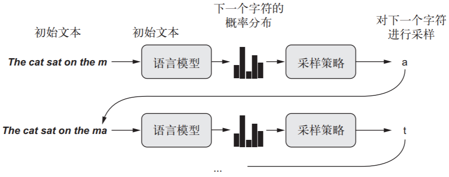
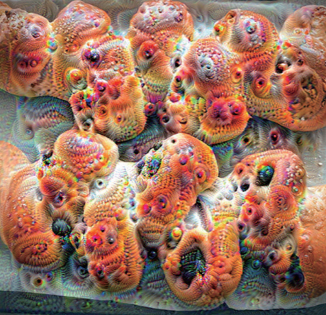
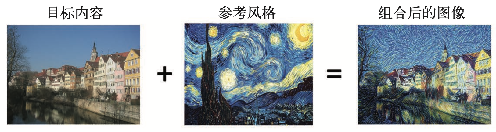

[TOC]

# 生成式深度学习

生成式学习即创造学习，深度学习开始创造

# 一、使用LSTM 生成文本

给定前面的标记（token，通常是单词或字符），能够对下一个标记的概率进行建模的任何网络都叫作语言模型（language model）。语言模型能够捕捉到语言的潜在空间（latent space），即语言的统计结构，从模型的 softmax 输出中进行概率采样是一种很巧妙的方法。


举个例子，

输入从文本语料中提取的*N*个字符组成的字符串，然后训练模型来生成第*N*+1个字符

下载并解析初始文本文件

``` python
import keras
import numpy as np
path = keras.utils.get_file('nietzsche.txt',
	origin='https://s3.amazonaws.com/text-datasets/nietzsche.txt')
text = open(path).read().lower()
print('Corpus length:', len(text))
```
将字符序列向量化
``` python
maxlen = 60
step = 3
sentences = []
next_chars = []

for i in range(0, len(text) - maxlen, step):
	sentences.append(text[i: i + maxlen])
	next_chars.append(text[i + maxlen])
print('Number of sequences:', len(sentences))

chars = sorted(list(set(text)))
print('Unique characters:', len(chars))
char_indices = dict((char, chars.index(char)) for char in chars)
print('Vectorization...')

x = np.zeros((len(sentences), maxlen, len(chars)), dtype=np.bool)
y = np.zeros((len(sentences), len(chars)), dtype=np.bool)
for i, sentence in enumerate(sentences):
	for t, char in enumerate(sentence):
		x[i, t, char_indices[char]] = 1
	y[i, char_indices[next_chars[i]]] =
```
构建网络
``` python
from keras import layers
model = keras.models.Sequential()
model.add(layers.LSTM(128, input_shape=(maxlen, len(chars))))
model.add(layers.Dense(len(chars), activation='softmax'))
optimizer = keras.optimizers.RMSprop(lr=0.01)
model.compile(loss='categorical_crossentropy', optimizer=optimizer)
```

``` python
def sample(preds, temperature=1.0):
	preds = np.asarray(preds).astype('float64')
	preds = np.log(preds) / temperature
	exp_preds = np.exp(preds)
	preds = exp_preds / np.sum(exp_preds)
	probas = np.random.multinomial(1, preds, 1)
	return np.argmax(probas
	
import random
import sys
for epoch in range(1, 60):
	print('epoch', epoch)
	model.fit(x, y, batch_size=128, epochs=1)
	start_index = random.randint(0, len(text) - maxlen - 1)
	generated_text = text[start_index: start_index + maxlen]
	print('--- Generating with seed: "' + generated_text + '"')
	
for temperature in [0.2, 0.5, 1.0, 1.2]:
	print('------ temperature:', temperature)
	sys.stdout.write(generated_text)
	for i in range(400):
	sampled = np.zeros((1, maxlen, len(chars)))
	for t, char in enumerate(generated_text):
		sampled[0, t, char_indices[char]] = 1.
	preds = model.predict(sampled, verbose=0)[0]
	next_index = sample(preds, temperature)
	next_char = chars[next_index]
	generated_text += next_char
	generated_text = generated_text[1:]
	sys.stdout.write(next_char)
```

# 二、DeepDream 图像修改技术

DeepDream 的过程是反向运行一个卷积神经网络，基于网络学到的表示来生成输入。不局限于图像模型，甚至并不局限于卷积神经网络。它可以应用于语音、音乐等更多内容。  

- 使用 DeepDream，我们尝试将所有层的激活最大化，而不是将某一层的激活最大化，因 此需要同时将大量特征的可视化混合在一起。
- ‰  不是从空白的、略微带有噪声的输入开始，而是从现有的图像开始，因此所产生的效果 能够抓住已经存在的视觉模式，并以某种艺术性的方式将图像元素扭曲。
- ‰  输入图像是在不同的尺度上[叫作八度(octave)]进行处理的，这可以提高可视化的质量。 我们来生成一些 DeepDream 图像。

举个例子，




# 三、神经风格迁移

风格迁移是指创建一张新图像，保留目标图像的内容的同时还抓住了参考图像的风格。




- 内容可以被卷积神经网络更靠顶部的层激活所捕捉到
- 风格可以被卷积神经网络不同层激活的内部相互关系所捕捉到
因此，深度学习可以将风格迁移表述为一个最优化过程，并用到了一个用预训练卷积神经网络所定义的损失

# 四、用变分自编码器生成图像

用深度学习进行图像生成，就是通过对**潜在空间**进行学习来实现的，这个潜在空间能够捕捉到关于图像数据集的统计信息。通过对潜在空间中的点进行采样和解码，我们可以生成前所未见的图像。这种方法有两种重要工具：变分自编码器（VAE）和生成式对抗网络（GAN）。
- VAE 得到的是高度结构化的、连续的潜在表示。因此，它在潜在空间中进行各种图像编辑的效果很好，比如**换脸**、将皱眉脸换成微笑脸等。它制作基于潜在空间的动画效果也很好，比如沿着潜在空间的一个横截面移动，从而以连续的方式显示从一张起始图像缓慢变化为不同图像的效果。  
- GAN 可以生成逼真的单幅图像，但得到的潜在空间可能没有良好的结构，也没有很好的连续性

# 五、生成式对抗网络简介

生成式对抗网络（GAN，generative adversarial network）由一个**生成器网络**和一个**判别器网络**组成。判别器的训练目的是能够区分生成器的输出与来自训练集的真实图像，生成器的训练目的是欺骗判别器。值得注意的是，生成器从未直接见过训练集中的图像，它所知道的关于数据的信息都来自于判别器。
- GAN 很难训练
因为训练 GAN 是一个动态过程，而不是具有固定损失的简单梯度下降过程。想要正确地训练 GAN，需要使用一些启发式技巧，还需要大量的调节
‰ GAN 可能会生成非常逼真的图像
但与 VAE 不同，GAN 学习的潜在空间没有整齐的连续结构，因此可能不适用于某些实际应用，比如通过潜在空间概念向量进行图像编辑