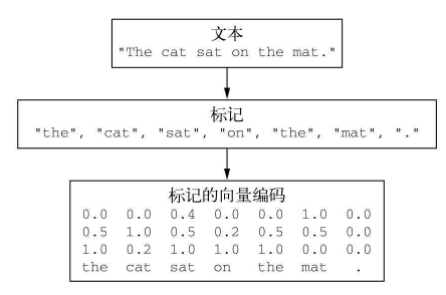
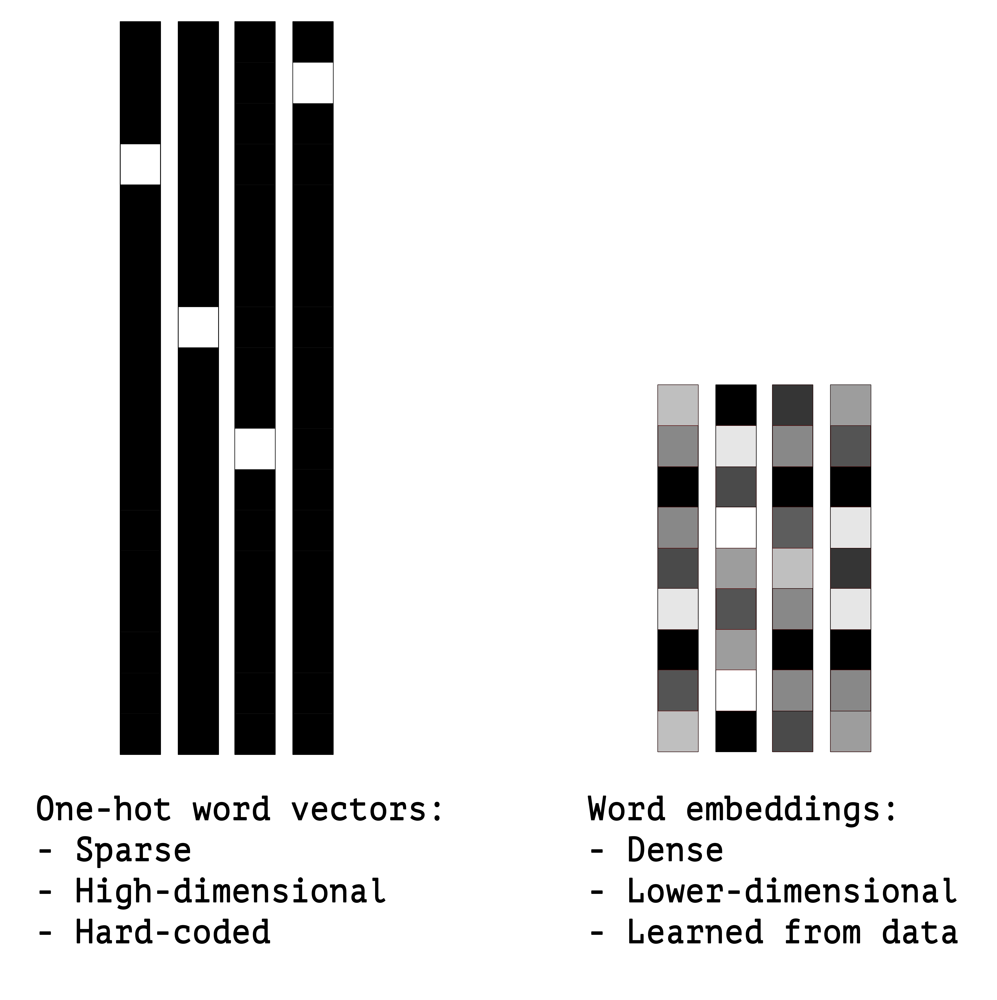
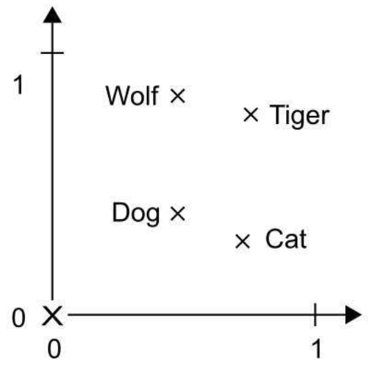
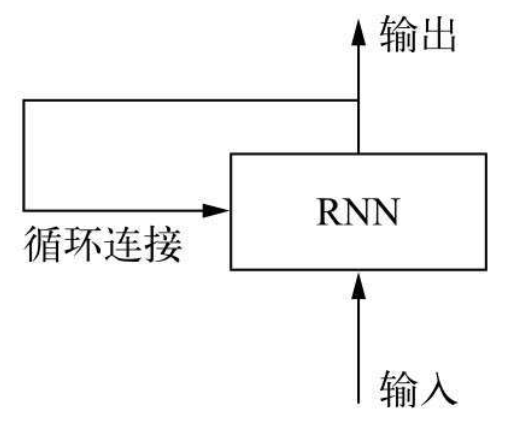
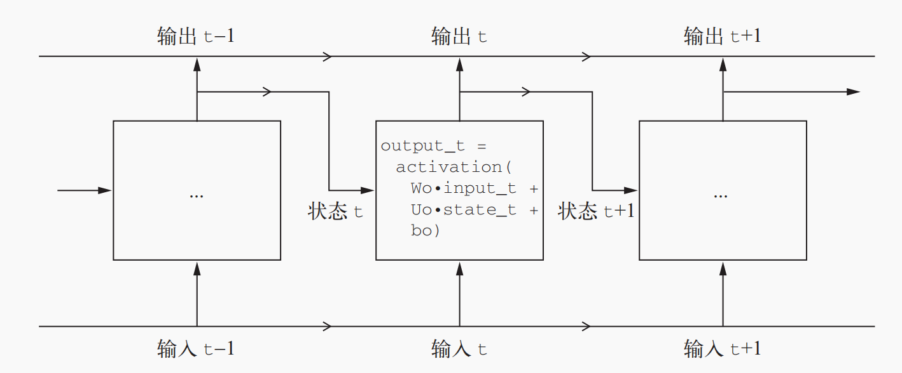
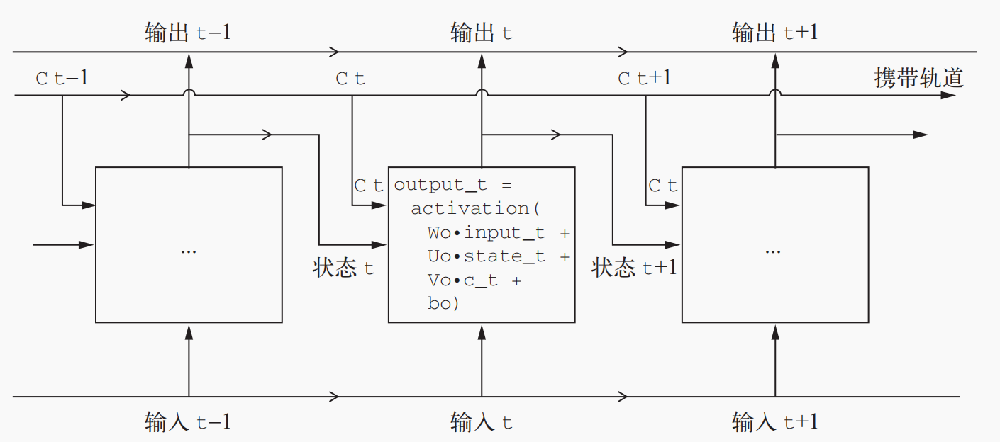
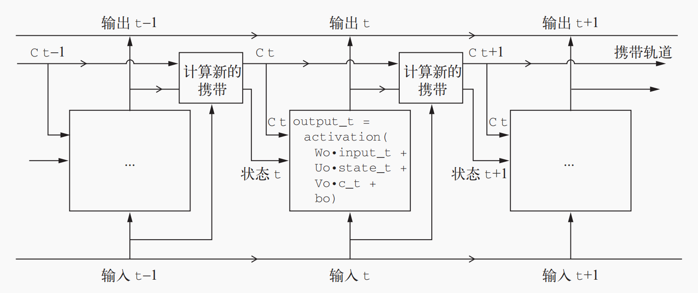
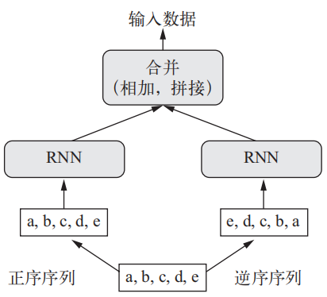
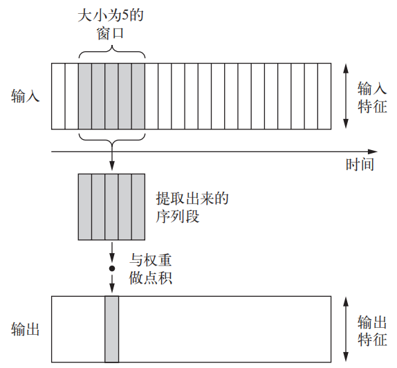
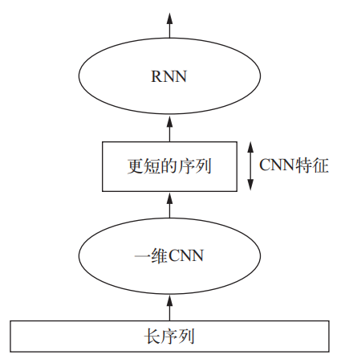

[TOC]
本篇涉及的内容

- 如何对文本分词

- 什么是词嵌入，如何使用词嵌入

- 什么是循环网络，如何使用循环网络

- 如何堆叠 RNN 层和使用双向 RNN，以构建更加强大的序列处理模型

- 如何使用一维卷积神经网络来处理序列

- 如何结合一维卷积神经网络和 RNN 来处理长序列

# 第一部分 文本处理

## 一、处理文本数据

深度学习模型不会接收原始文本作为输入，它只能处理数值张量，文本向量化的几种思路
- 文本分割成单词，单词向量化
- 文本分割成字符，字符向量化
- 文本分割成单词或字符，提取n-gram，将每个n-gram向量化（n-gram是从句子中提取N个或更少的连续单词的集合，如对于句子a b c d， 2-gram提取的集合是{a, ab, b, bc, c, cd, d}，该集合叫二元语法袋）  




文本向量化的常用方法 —— one-hot编码、词向量

### 1.1 one-hot 编码

- one-hot 
常见方案，将单词按照01形式编排，举个例[北京、上海、广州、深圳]，二进制one-hot编码为[0001, 0010, 0100, 1000]；
典型的特征是：高纬、稀疏、忽略文本中单词之间的顺序
```
from keras.preprocessing.text import Tokenizer

samples = ['The cat sat on the mat.', 'The dog ate my homework.']

tokenizer = Tokenizer(num_words=1000)
tokenizer.fit_on_texts(samples)

one_hot_results = tokenizer.texts_to_matrix(samples, mode='binary')
print('texts_to_matrix')
print(one_hot_results.shape)
print(one_hot_results)
```

- 散列one-hot
散列是为了解决one-hot高纬稀疏的问题，人为的加上一层hash映射，降维的问题是可能会有单词hash值相同，造成数据丢失
```
samples = ['The cat sat on the mat.', 'The dog ate my homework.']

dimensionality = 8
max_length = 10

results = np.zeros((len(samples), max_length, dimensionality))
for i, sample in enumerate(samples):
    for j, word in list(enumerate(sample.split()))[:max_length]:
        index = abs(hash(word)) % dimensionality
        results[i, j, index] = 1.
print(results)
```

### 1.2 词向量Word Embedding

因为one-hot编码得到的向量是稀疏的、高维的、硬编码的，且不会考虑词与词之间的联系，所以有了词向量

而词嵌入是相对低维的密集浮点数向量，且从数据中学习得到的 ，常见的维度只有256、512、1024



- 理解词向量

词向量之间的关系（距离、方向）表示这些词之间的语义关系

  

从cat到tiger的向量与从dog到wolf的向量相等，这个向量可以被解释为“从宠物到野生动物”向量。

同样，从dog到cat的向量与从wolf到tiger的向量也相等，它可以被解释为“从犬科到猫科”向量


获取词嵌入有两种方法

* 直接在网络中增加Embedding层，在完成主任务的时候同时学习词嵌入

* 直接将其他预训练好的词嵌入，直接用于模型，预训练词嵌入（ pretrained word embedding）  
    * word2vec
    * GloVe（global vectors for word representation，词表示全局向量）

### 1.3 整合在一起：从原始文本到词嵌入


# 第二部分 循环神经网络
## 一、基本使用场景

- 文档分类和时间序列分类，比如识别文章的主题或书的作者
- 时间序列对比，比如估测两个文档或两支股票行情的相关程度
- 序列到序列的学习，比如将英语翻译成法语
- 情感分析，比如将推文或电影评论的情感划分为正面或负面
- 时间序列预测，比如根据某地最近的天气数据来预测未来天气

## 二、理解循环神经网络

遍历所有序列元素，并保存一个状态（state），每次处理的时候输入为本次输入+当前状态，在处理两个不同的独立序列（比如两条不同的IMDB评论）之间，RNN状态会被重置，因此，你仍可以将一个序列看作单个数据点，即网络的单个输入。真正改变的是，数据点不再是在单个步骤中进行处理，相反，网络内部会对序列元素进行遍历




```python
state_t = 0 
for input_t in input_sequence: 
	output_t = f(input_t, state_t)
	state_t = output_t
```

### 2.1 RNN

循环神经网络（RNN、recurrent neural network）是具有内部环的神经网络，上一层的输出作为下一层的状态输入，状态输入+本层输入得到本层输出




### 2.2 LSTM

随着层数的增加容易出现梯度消失，增加网络层数将变得无法训练，继而就有了长短期记忆（LSTM，long short-term memory)。LSTM增加了一种携带信息跨越多个时间步的方法。





LSTM 层是 SimpleRNN 层的一种变体，它增加了一种携带信息跨越多个时间步的方法。假

设有一条传送带，其运行方向平行于你所处理的序列。序列中的信息可以在任意位置跳上传送带，

然后被传送到更晚的时间步，并在需要时原封不动地跳回来。这实际上就是 LSTM 的原理：它

保存信息以便后面使用，从而防止较早期的信号在处理过程中逐渐消失。


总之，你不需要理解关于 LSTM 单元具体架构的任何内容。作为人类，理解它

不应该是你要做的。你只需要记住 LSTM 单元的作用：允许过去的信息稍后重新进入，从而解

决梯度消失问题

### 2.3 GRU

门控循环单元（GRU，gated recurrent unit）层的工作原理与 LSTM 相同。但它做了一些简化，因此运

行的计算代价更低（虽然表示能力可能不如 LSTM）。


## 三、循环神经网络的高级用法

### 3.1 循环dropout

使用循环dropout (recurrent dropout) 降低过拟合

dropout，即将某一层的输入单

元随机设为 0，其目的是打破该层训练数据中的偶然相关性

对每个时间步应该使用相同的 dropout 掩码（dropout 

mask，相同模式的舍弃单元），而不是让 dropout 掩码随着时间步的增加而随机变化此外，为

了对 GRU、LSTM 等循环层得到的表示做正则化，应该将不随时间变化的 dropout 掩码应用于层

的内部循环激活（叫作循环 dropout 掩码）。对每个时间步使用相同的 dropout 掩码，可以让网络

沿着时间正确地传播其学习误差，而随时间随机变化的 dropout 掩码则会破坏这个误差信号，并

且不利于学习过程。


### 3.2 堆叠循环层

堆叠循环层(stacking recurrent layers) 提高网路表达能力

增加网络容量的通常做法是增加每层单元数或增加层数。循环层堆叠（recurrent layer 

stacking）是构建更加强大的循环网络的经典方法，

‰ 因为过拟合仍然不是很严重，所以可以放心地增大每层的大小，以进一步改进验证损失。

但这么做的计算成本很高。

‰ 添加一层后模型并没有显著改进，所以你可能发现，提高网络能力的回报在逐渐减小


### 3.3 双向循环层

双向循环层 (directional recurrent layer) 将相同的信息以不同的方式呈现给循环网络，

可以提高精度并缓解遗忘问题

双向 RNN 是一种常见的

RNN 变体，它在某些任务上的性能比普通 RNN 更好。它常用于自然语言处理，可谓深度学习

对自然语言处理的瑞士军刀

它包含两个普

通 RNN，比如你已经学过的 GRU 层和 LSTM 层，每个 RN 分别沿一个方向对输入序列进行处理

（时间正序和时间逆序），然后将它们的表示合并在一起。通过沿这两个方向处理序列，双向

RNN 能够捕捉到可能被单向 RNN 忽略的模式。




### 3.4 更多尝试

在堆叠循环层中调节每层的单元个数。当前取值在很大程度上是任意选择的，因此可能

不是最优的。

‰ 调节 RMSprop 优化器的学习率。

‰ 尝试使用 LSTM 层代替 GRU 层。

‰ 在循环层上面尝试使用更大的密集连接回归器，即更大的 Dense 层或 Dense 层的堆叠。

‰ 不要忘记最后在测试集上运行性能最佳的模型（即验证 MAE 最小的模型）。否则，你开

发的网络架构将会对验证集过拟合

# 第三部分 使用一维卷积神经网络

## 一、理解序列数据的一维卷积
二维卷积神经网络在二维空间中处理视觉模式时表现很好，与此相同，一维卷积神经网

络在处理时间模式时表现也很好。对于某些问题，特别是自然语言处理任务，它可以替

代 RNN，并且速度更快。


一维卷积神经网络的工作原理：每个输出时间步都是利用输入序列

在时间维度上的一小段得到的

这种一维卷积层可以识别序列中的局部模式



通常情况下，一维卷积神经网络的架构与计算机视觉领域的二维卷积神经网络很相似，

它将 Conv1D 层和 MaxPooling1D 层堆叠在一起，最后是一个全局池化运算或展平操作

## 二、结合CNN 和RNN 来处理长序列

一维卷积神经网络分别处理每个输入序列段，所以它对时间步的顺序不敏感

要想结合卷积神经网络的速度和轻量与 RNN 的顺序敏感性，一种方法是在 RNN 前面使用

一维卷积神经网络作为预处理步骤





因为 RNN 在处理非常长的序列时计算代价很大，但一维卷积神经网络的计算代价很小，

所以在 RNN 之前使用一维卷积神经网络作为预处理步骤是一个好主意，这样可以使序

列变短，并提取出有用的表示交给 RNN 来处理


> @ WHAT - HOW - WHY